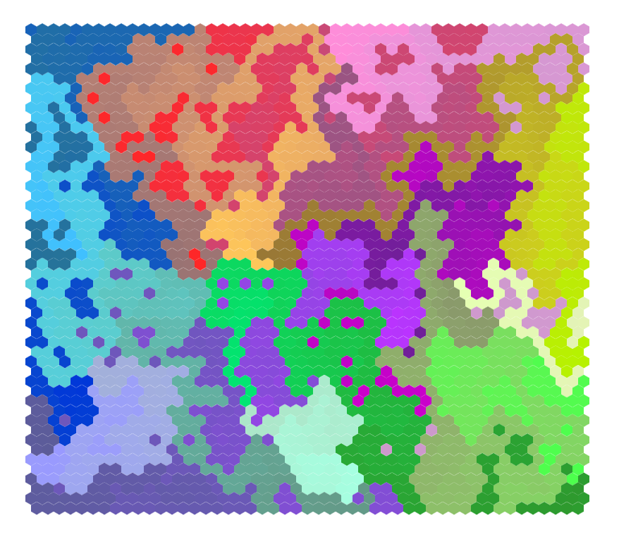

# Hex Grid

Artwork n°1 pour le cours IFT IFT 6152 - Art Algorithmique

## Inspiration

Prompt of genuary 29 : ["Grid-based graphic design"](https://genuary.art/prompts#jan29).

Pourquoi les hexagones : [youtube : CGP-Grey](https://youtu.be/thOifuHs6eY?si=o6-G6Im-qrZe7r2j)

## Exécution

Ouvrir le fichier `index.html` dans un browser.

Les variables à changer pour bidouiller dans `sketch.js` :

```
const side = 800; // w & h of canva
const nb = 55 // number of hexagons in top line
const thick = 0; // épaisseur entre chaque hexagone
```

## Result :


