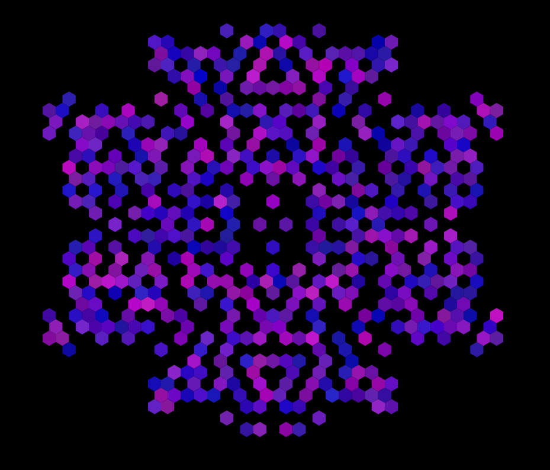

# Hex Life

Artwork n°2 pour le cours IFT 6152 - Art Algorithmique

## Inspiration

Game of life : [wiki](https://en.wikipedia.org/wiki/Conway%27s_Game_of_Life)

Exemple : [the game of life emergence in generative art](https://www.artnome.com/news/2020/7/12/the-game-of-life-emergence-in-generative-art)

## Exécution

Ouvrir le fichier `index.html` dans un browser.

Les variables à changer pour bidouiller dans `sketch.js` :

```
const side = 800; // w & h of canva
const nb = 36 // number of hexagons in top line
const fr = 5; // frame rate

max_nb_iteration = random(nb/2,nb) // nombre d'itération maximum 
```

Le nombre d'itération max est décidé dans la fonction `setup()` mais pour l'ignorer (code tourne sans fin) on peut supprimer `noLoop()` dans `draw()`

Pour changer les régles du jeu : dans `initiate()` :

```
if (cell.alive[pos]){
    if (cnt < 2 || cnt > 3) {
      cell.alive[(pos + 1) % 2] = false;
    } else {
      cell.alive[(pos + 1) % 2] = true;
    }
  } else {
    if (cnt == 2) {
      cell.alive[(pos + 1) % 2] = true;
    } else {
      cell.alive[(pos + 1) % 2] = false;
    }
  } 
```

Dans cette configuration :
- une cellule vivante le reste si 2 ou 3 voisins sont vivants, meurt sinon
- une cellule morte "revit" si 2 voisins sont vivant, reste morte sinon

## Result :


