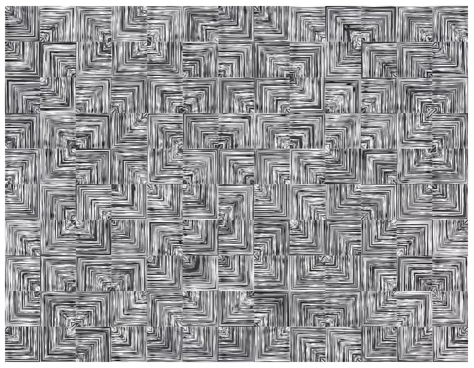
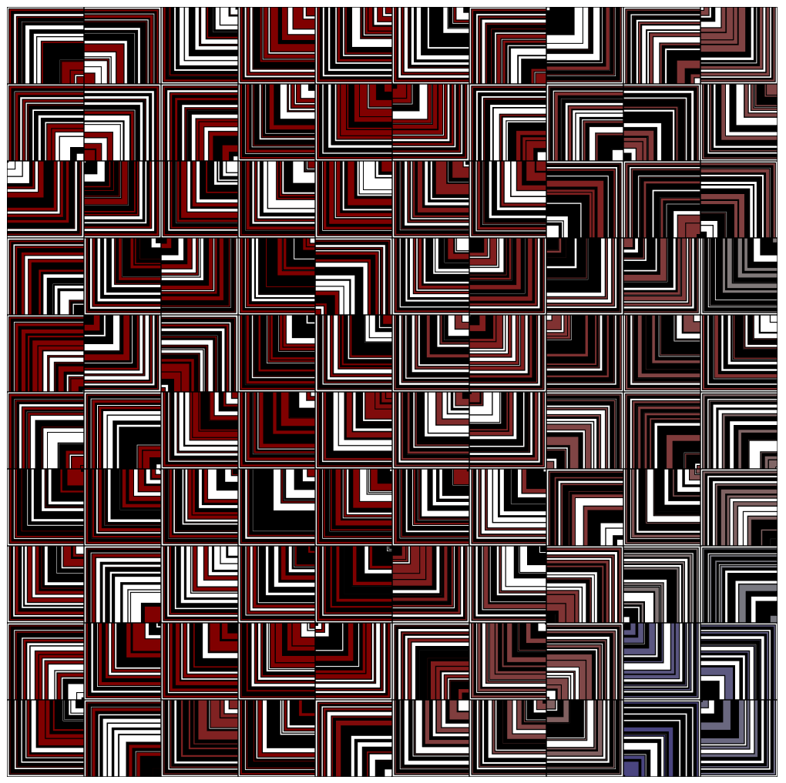

# Météo²

Ce projet consiste à utiliser des données météo live dans une oeuvre d'art générative.

## Inspiration 

Je me suis inspiré de [cette oeuvre](https://www.generativehut.com/post/harnessing-randomization-in-adobe-illustrator) par boris897, en modifiant les couleurs et la direction des carrées en fonction de mes données en entrée.



## Fonctionnement

Le canva se compose de *'grand carrés'* qui composent une grille. Pour chaque *grand carré*, on obtient des données météo d'un point dans le monde, à savoir la température et la direction du vent. Avec ces données, on choisit une température et une "*direction*" pour les carrés à l'intérieur.

Les coordonées sont assez simple, le carré en haut à gauche est en latitude 0, longitude 0, et quand on va en bas on augmente de 5 la longitude, similairement, on augmente de 5 la longitude quand on va à droite. On commence donc en (0,0) à [Null Island](https://fr.wikipedia.org/wiki/Null_Island) dans le golf de guinée et on finit à (50,50) dans le district de Kaztal au kazakhstan. Outil pour déterminer l'adresse en fonction des [coordonnées](https://www.gps-coordinates.net/) et le [vent](https://www.windy.com/?46.141,-18.246,4).

J'ai utilisé [open-meteo.com](https://open-meteo.com/) pour obetenir les données de température et de direction du vent. L'API a une limite de 10000 requêtes par jour et l'oeuvre fait (avec la configuration initiale) 100 requêtes par génération. Il y a une requête par " *grand carré* ", et `nb_squares` détermine le nombre de carré par côté. Il y aurra donc toujours `nb_squares` au carré requêtes. Voilà la [documentation API](https://open-meteo.com/en/docs) de open-meteo.

Certaines fonctions sont `async` car elles attendent le résultat d'une requête.

Le code se compose en différentes sections :

- ` ~ VARIABLES REQUETE ~ ` : Les variables initiales requises pour faire la requête :
	```javascript
	const url = "https://api.open-meteo.com/v1/forecast";
	const params = {...}
	```

- ` ~ VARIABLES CANVA ~ ` : Les variables du canva (taille, nombre de carrées...) :
	```javascript
	const side = 800;
	let nb_squares = 10
	let size_square = side / nb_squares
	let colors = ["black","white","white"]
	let index = 0
	```
- ` ~ FONCTIONS P5 ~ ` : Les fonction requise pour `P5` :
	```javascript
	function setup(){...}
	```

- ` ~ FONCTIONS DESSIN ~ ` :  Les fonctions pour dessiner les formes :
	```javascript
	async function draw_big(){...}
	function draw_squares(i,j,angle,temp){...}
	function getColorFromTemp(temp){...}
	function getDirFromAngle(angle){...}

	```
- ` ~ FONCTIONS REQUETE ~ ` : Les fonctions pour faire des requêtes à l'api
	```javascript
	function makeURL(url,lat,long,params){...}
	function getData(url){...}
	```

## Exécution

Ouvrir le fichier `index.html` dans un browser, il faut une connection internet pour faire les requêtes à open-meteo.

## Résultat


